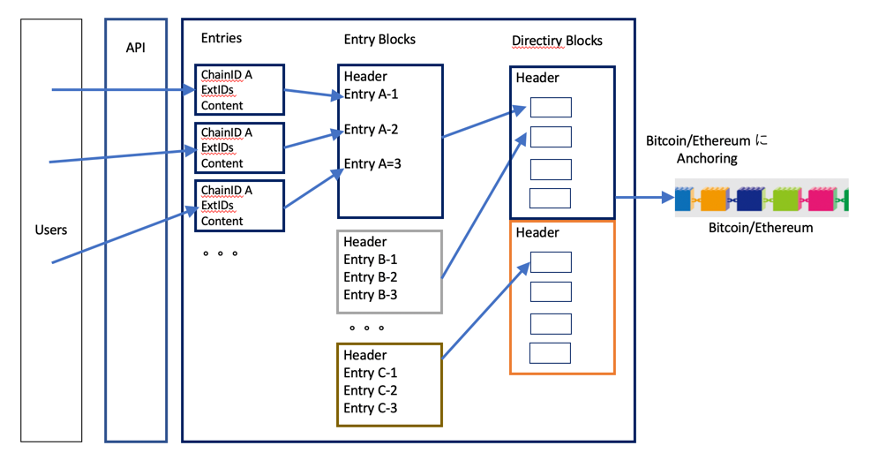
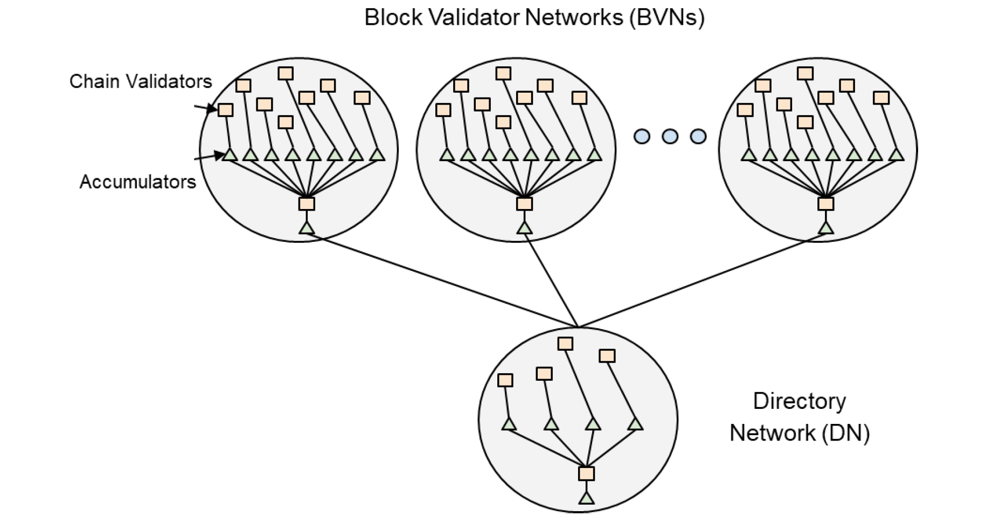
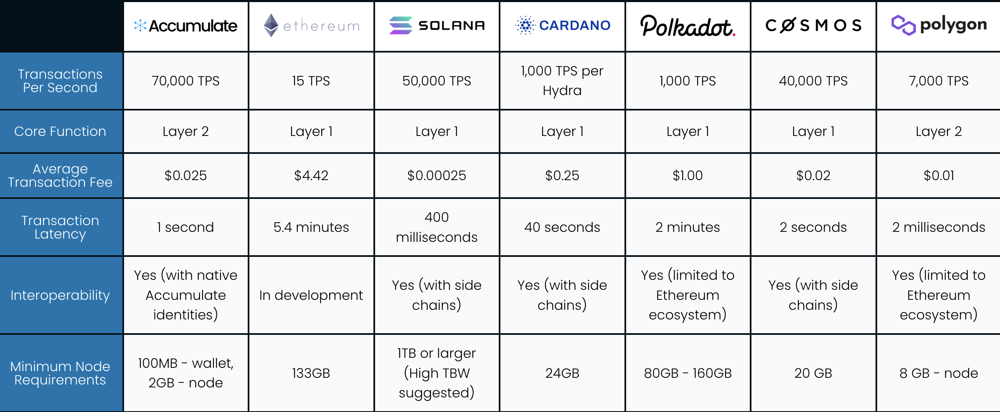

# Factom の紹介、 そして Accumulate へ

本稿では、デジタルIDの発行・管理と各種契約書への署名、およびその真正性の検証システムを提供するOff-Blocks, Ltd.（英国）がバックエンドに使用している Factom について、その特徴やメリットなどを紹介する。
なお、Factom は Accumulateへ移行する予定であるので、Accumulateの概要をも紹介する。　

初版　2021年3月7日

追記　2022年3月28日  「A.　Factom と Accumulate」

 

## 1. はじめに　
デジタルIDの発行・管理と各種契約書への署名、およびその真正性の検証システムを提供する Off-Blocks は、バックエンドにブロックチェーンを使用している。ブロックチェーンを使用することにより、以下のメリットがある。

- Off-Blocks の管理する署名、証明書などの記録を何人も改竄（変更、削除など）することができないので、データの真正性を担保できる。
- Factomブロックチェーンの記録は、パブリックにアクセスできる。誰でも、いつでも参照ができ、記録の監査証跡を検証することが可能である。
- 個人のプライバシー情報、秘密情報はブロックチェーンには記録せず、ハッシュ値のみを記録する設計をすれば、プライバシーを保護できる。
- 中間に第三者の管理者がいないので、低価格のサービスを実現できる。

### 数多いブロックチェーン　　
2009年にBitcoin が世に出てから10余年の間にEthereum、Hyperledger、Cordaなどをはじめ、派生形をも含め、今や200〜300種類のブロックチェーンが提案されている。システムを開発する際には、どのブロックチェーンを採用するかを事前に検討する必要がある。

### ブロックチェーンの課題
ブロックチェーンは従来の集中管理システムや、分散システムではなく、新しいタイプの非中央集権型システムである。金融をはじめとする様々な分野での利用が検討され、利用が始まっている。
では、ブロックチェーンには課題がないのであろうか？　大きな課題としてよく議論されるのは、以下の2項目である。

（1）パーフォーマンス

パブリックのブロックチェーンは、外部からの攻撃や参加しているノードの悪意の攻撃を防止することが必要である。アンチ・ビザンティン・アルゴリズムや、多数のノードが協調してデータの整合性を維持するためにコンセンサス・アルゴリズムを採用して、高いセキュリティを実現している。反面、ブロックが検証されるまでに要する時間はコンセンサス・アルゴリズムとしてPoWを採用しているBitcoinでは10分、Ethereumでは約17秒かかる。更に当該のブロックが確定するまでにBitcoinでは1時間、Ethereumでは1分ほどかかるなど、処理速度に課題がある。

（2）スケーラビリティ

ブロックチェーンでは、参加しているノードがすべてのデータを保持し、すべての処理を一律に実行するため、一部のノードが故障しても、他のノードが動作することによって全体のシステムがダウンすることはない。反対にトランザクションの数が大きく増加しても対抗することができない。

### 課題克服の取組み
パーフォーマンス、スケーラビリティなどの課題を解決するために、新しい技術や新しいブロックチェーンが提案されている。一部は既に運用が開始されている。

- Bitcoin用のレイヤー２技術のLightning。既に稼働中
- Ethereum用のレイヤー２技術のRaiden
- Shardingを採用したブロックチェーン
- Ethereum 2.0:    Ethereumの第2版として新たにEthereum 2.0（ETH2）が開発されており、その初期の版が昨年末に稼働し始めている。シャーディング、コンセンサス・アルゴリズムをPoWからPoSに変更している。

  

## 2. Factomの採用

Factomは2014年から開発が始められている老舗のブロックチェーンである。しかも、当初から記録管理に向いたブロックチェーンとして注目されている。（残念ながら日本でのそれほどポピュラーではない。）本節ではFactomの特徴を解説するとともに、Off-Blocks が提案するデジタルID、デジタル署名、デジタル証明書の管理にFactomが適していることを確認する。

### 記録管理用のブロックチェーン
Factom は記録管理に特化したブロックチェーンとして開発されている。汎用のブロックチェーンなので、多くの種類の記録管理アプリケーションで利用できる。

また、スマートコントラクトの開発・実行機能が組み込まれていない極めてシンプルなブロックチェーンである。

### パーフォーマンス
Factom はパブリックアクセスが可能な、コンソーシアム型のブロックチェーンであり、ANO（Authority Node Operators、後述）によって運用されている。

採用されているコンセンサス・アルゴリズムはPoA。Authorityと呼ばれる複数のノードによってブロックの生成・検証がおこなわれるので、トランザクションのブロックが確定する時間は数百ミリ秒と極めて速い。

高速なパーフォーマンスが得られる一方、コンソーシアム型でPoAを採用しているために、そのセキュリティが懸念されるかもしれない。これに対して、Factomは処理を終えたブロックを更にBitcoinとEthereumに書き込んで、非改竄性を高めている。Anchoringと呼んでいる。Factomはブロックを複数個（1000個程度）とりまとめ、そのハッシュ値をAnchoring している。

### 予算内で使用できる
Bitcoinは歴史的に価格が上下に大きく変動しており、本来の少額送金だけではなく、資産運用（投機）としての期待があることは否めない。他のブロックチェーン、例えばEthereum、TezosなどでもBitcoinほどでないにしろ、大きな価格の変動を経験している。

ブロックチェーンを利用する際には、利用に応じた手数料を支払う。業務で使おうとしたとき、ブロックチェーンのトークンの価格変動によっては、年初に予定した予算の範囲で収まらないケースもでてくる。

一方、Factomは2トークン制（Two Token）であり、外向きのファクトロイド（Factroids）と、手数料支払い用のエントリー・クレジット（Entry Credits）を採用している。

FactroidsからEntry Creditsに変更して、Factomを利用する手数料を支払う。使用されたEntry Creditsは消滅する（Burnと呼ぶ）。反対に、一度Entry Creditsに変更したものは、再びFactroidsに戻すことはできない。

とはいえ、Factroidsの価格が大きく変動した場合は、ANOのコミッティはEntry Credits：Factroidsの交換比率を変更し、妥当な範囲でFactomを継続利用できるように調整することができる。定額で利用できるということである。（今までに比率が変更されたことはなかったが。。。）　

### Factomのデータ構成
Factomはブロックチェーンであるため、ユーザが発行するデータの塊であるブロックはポインターで結ばれ、一列に整列した形をとっている。そのうち、アプリケーションが扱う一連のデータにChain Nameを付けることができる。Factom内では、Chain Nameをハッシュ化したChain IDで制御される。

ユーザのデータはEntryとして、ChainID、付記としてのExtID、ユーザデータのContentから構成される。Entryがいくつか集まってEntry Blockが構成される。さらに、Anchoringのために、いくつかのEntry BlockからDirectory Block が形成され、BitcoinとEthereumに書き込まれる。（図1）

**図1　Factomのデータ構成（概要）**

以上の他にも、Entry Credit Block、Factroid Block、およびAdministrative Blockなどが存在する。

### Factom Explorer
Factomのデータを参照するには、ユーザアプリケーションがFactom APIを使用してFactomからデータを読み出し、そのアプリケーションにあった形でデータを表示する。もしくはFactomが提供するFactom Explorerを利用することができる。しかし、Explorerは一般ユーザ向きではなく、開発者向きであることに注意されたい。             
例）https://explorer.factoid.org/　

### Factomの運用
Factomは初期の開発者であったFactom Inc.からFactom Protocol Foundationにその権限が委譲されている。https://www.Factomprotocol.org

Factom Protocol Foundationのもとに、ユーザコミュニティ、ガバナンスを司る委員会、ネットワークの運用を担当するANO（Authority Node Operators）の組織がある。

ANOには欧米を中心とした企業が参加している（2021年3月3日現在32ノード）。ノードの条件を満たせば誰でもANOに立候補することができ、委員会で審査される。

(注) 2020年3月にFactomの創始者であるPaul Snow氏が率いるFactom Inc.（Austin, TX, USA）の清算のニュースが話題になった。実際、同社は同年6月に米国の連邦破産法第11条の適用を申請している。しかし、2018年からFactomの開発・運用はFactom Protocol Foundationに委譲されているため、Factomへの影響はない。最近では、Factom Inc.は一開発企業としてANOにも参加している。
下記「付録 A．Factom と Accumulate」も参照のこと。

### Factomのユースケース
Factomの利用はその開発当初から試みられている。

•	医療記録の整備

UNHCR（国連難民高等弁務官事務所）の行ったアフリカ諸国における医療記録の整備プロジェクト。ビル＆メリンダ・ゲーツ財団からのグラントを受け実施された。

•	住宅ローン契約の管理

Factom Inc.はローン契約などのビジネスプロセス用のアプリケーション・フレームワークとしてHarmonyをリリースした。

•	マイナンバーへのアクセス記録の管理

2017年に筆者らが行った本邦初のFactomを利用したPoC。自治体の窓口で職員がマイナンバー・システムへアクセスした時、そのアクセス記録をFactomに残し、アクセス記録管理などに提供する目的で実施された。

•	ステーブルコインへの応用

2019年にFactomをベースにしたステーブルコイン PegNetが開発され、運用が開始された。

応用事例については、以下のサイトを参照されたい。

- https://www.Factomprotocol.org
- https://Factom.world

以上、Factom は記録管理に特化したブロックチェーンとして早くから開発が進み、その構造のシンプルさ、パーフォーマンスの良さ、企業でも利用できる一定の手数料、ユースケースも多いことから、ビジネスにおける記録管理に適したブロックチェーンといえよう。

 
  

## 3．サプライチェーン アプリケーションでの位置づけ

Factom ブロックチェーンは、サプライチェーンのアプリケーションから Off-BlocksのデジタルID・署名・証明管理サブシステム経由でアクセスされる。その状況を 図２ に示す。ここではサプライチェーンアプリケーションとしてアワビ、ホタテなどの水産物の原産地証明の発行とその追跡、かつ消費者サイド（中間の流通業者をも含む）において原産地証明を容易に検証できるアプリケーションを取り上げる。

（図２以下 省略）

 

なお、Factom は  FACTOM Protocol  (https://www.factomprotocol.org)  がすべての権利を保有しています。

以上、初版。

 

## 付録 A．Factom と Accumulate

その後、Factom Inc.は Inveniam Capital Partners（米国 https://inveniam.io/ ）に買収され、その一員となっている。Factomのブロックチェーン技術は Aaccumulateとして再構成され、現在 (2022/3/28) Mainnet のラウンチの手前まで来ている。

### Accumulate の特徴
•	**ADI (Accumulate Digital Identifier) 中心の企業向きブロックチェーン**

Accumulate は Factomを引き継いではいるが、DIgital Identityを中心にブロックチェーンを構成し、より Decentralizedな作りとなっている。企業（に限らずあらゆる組織）では階層構造を持つ。その構成員（部署、人、デバイス、。。。）が各々の DIgital Identity ADI (Accumulate Digital Identifier) を持ち、それに対応した独立のサブ・ブロックチェーン、しかも数種類のサブ・ブロックチェーンを所有する。Factomで自由にチェーンを作成できたが、その拡張と考えるとよい。階層構造の ADI（acc://ADI/account の形式）と、階層構造を持つキー管理を有する。これらの点からも企業向き、ビジネス向きブロックチェーンと言えよう。

•	**Validator - Accumulator**

ある DIgital Identityのサブ・ブロックチェーンに書き込まれるトランザクションはそのサブ・ブロックチェーンの Validatorによって検証され、その集まりの BVN (Block Validator Network)が構成される。各構成員に対応した多数のサブ・ブロックチェーン、多数のValidatorによって検証された結果は Accumulator（集積者）によって取りまとめられ、DN (Directory Network) が作成される。Entry Blocks → BV Network、Directory Blocks → Directory Network。Accumulatorの存在は Factomとは異なる点である。
 

**The components of Block Validator and Directory Block Networks**  （出典: ACCUMULAE Protocol Litepaper v2.0）

BVNは実績のある Tendermint (COSMOS) をベース。
DNからBitcoin、Ethereum、。。。にアンカリングし、セキュリティを向上させている（のは Factomと同じ）。 

詳しくは、以下を参照。

・https://accumulatenetwork.io/

・ドキュメンテーション:  https://docs.accumulatenetwork.io/accumulate/

・Lite paper:  https://accumulatenetwork.io/litepaper

・https://github.com/AccumulateNetwork/accumulate-docs

### 他のブロックチェーンとの比較

https://accumulatenetwork.io/ では他のブロックチェーンとの特徴比較を謳っている。

**Interoperability with Accumulate** （出典:  https://accumulatenetwork.io/）

•	Accumulateは Layer2技術。多くのLayer1と統合できる。

•	Factomが当面4,000TPSを目標にしていた　→  70.000TPS

•	Factom と同じく Dual Tokens（ACMEと Credits）を採用し、固定費用で利用できる。

などなど、期待される。

なお、Factomの開発・運用主体である Factom Protocol Foundation は Accumulate に移行する旨を表明している。（2021/12/7）
https://accumulatenetwork.io/2021/12/factom-validators-vote-unanimously-to-approve-upgrade-to-accumulate/

 
### ©2022 Hybrid IT Labs.

